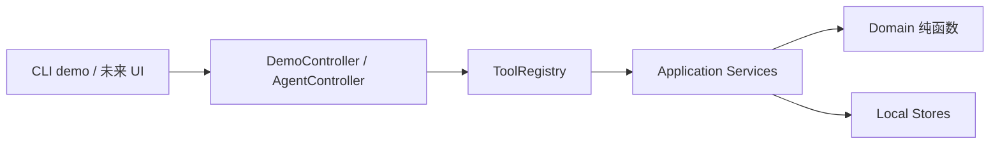
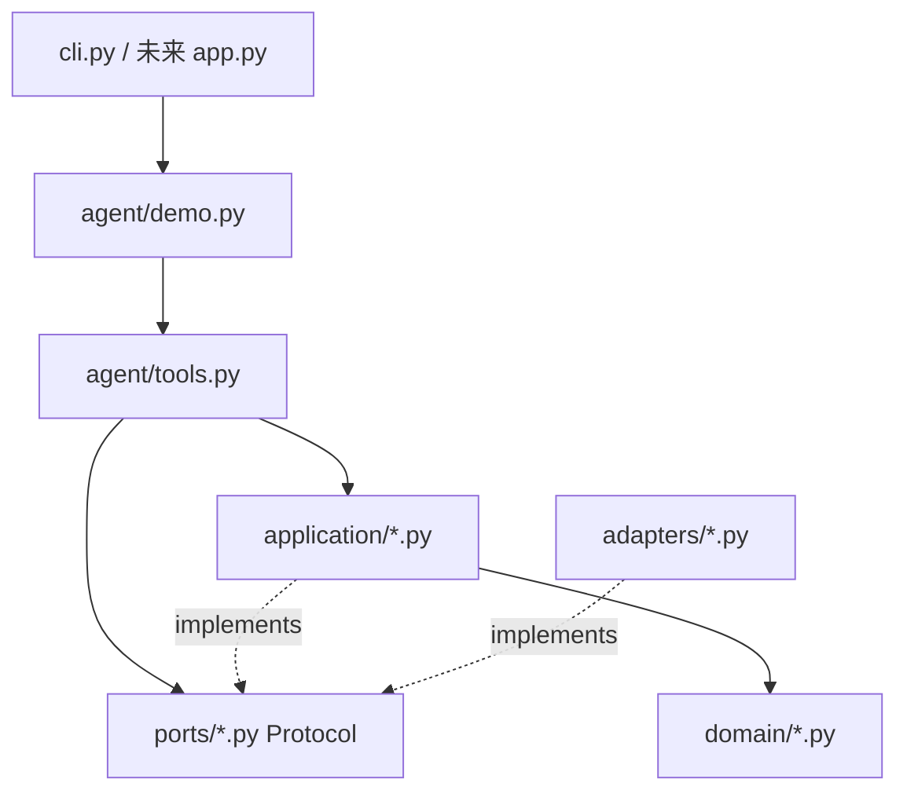
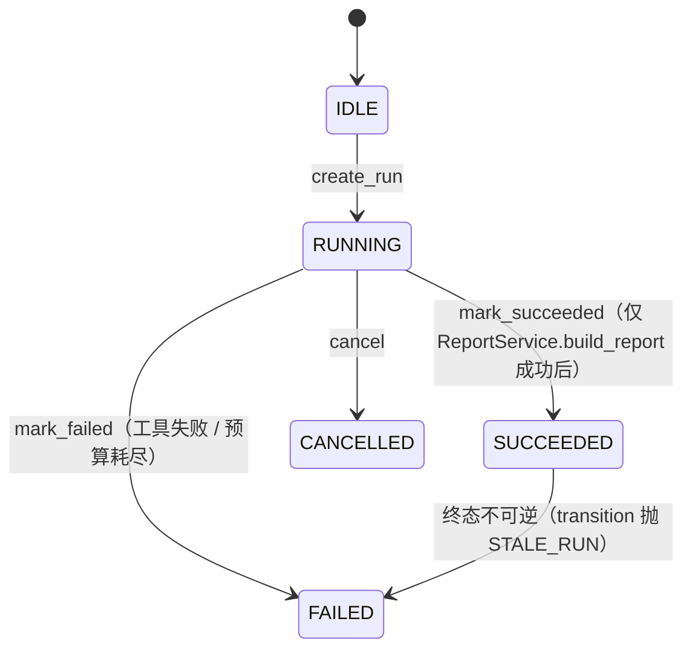

# QuantLab Agent 架构讲义

> 文档版本：v1.0  
> 建立日期：2026-10-02  
> 阅读对象：第一次读代码的人、面试前复盘的人  
> 阅读建议：先读 [§1 心智模型](#1-心智模型) 和 [§2 一条命令的旅程](#2-一条命令的旅程)，其余按兴趣翻阅。设计依据参考 [`architecture.md`](architecture.md)。

## 1. 心智模型

整个项目可以浓缩成一句话：

> **用确定性程序做数据分析，把语言模型当作"自然语言 → 受控工具调用"的翻译器。**

这种分工带来三个具体收益：

1. **指标可复现**。区间收益、年化波动率、最大回撤由纯函数计算，相同数据 + 相同参数 + 相同计算版本永远得到相同数字。
2. **失败可定位**。每次工具调用都记录到 `tool_calls.jsonl`，任何"模型嘴上说正确但实际不对"的输出都能被证据校验拦截。
3. **真模型接入只是替换驱动方**。M3 接真实模型时，工具层与运行记录都不需要改写——同一 `ToolRegistry`，一个由 demo 控制器调用，一个由模型循环调用。



记住这张图，剩下的内容就是把它放大。

## 2. 一条命令的旅程

让我们跟着 `python -m quantlab_agent.cli demo --scenario all --runs-dir runs` 从头走一遍。

### 2.1 入口组装

`cli.py` 的 `main()` 解析参数后调用 `default_demo_controller(runs_dir)`：

```python
# src/quantlab_agent/agent/demo.py:default_demo_controller
def default_demo_controller(runs_dir: Path) -> DemoController:
    runs_dir = Path(runs_dir).resolve()
    dataset_store = LocalDatasetStore(runs_dir)
    run_store = LocalRunStore(runs_dir)
    chart_store = LocalChartStore(runs_dir)
    report_store = LocalReportStore(runs_dir)
    ...
    registry = default_registry(...)  # ← 把所有 service + store 注入 ToolRegistry
    return DemoController(...)
```

**为什么不在 DemoController 内部 new 出所有依赖？** 因为测试要把它们换成 fake 实现，或者用同一个 service 装配到 CLI、UI、未来的 AgentController。这叫"组合根"模式——只在程序入口处 wire up 一次。

### 2.2 第一个场景：two-asset

`run_two_asset(session_id)` 走三步：

1. **建 Run**：`RunService.create_run(...)` 生成 `run_id`，状态为 `RUNNING`，写到 `<runs>/<session>/runs/<run>/manifest.json`。
2. **导入数据集**：从 `data/examples/DEMO_A.csv`、`DEMO_B.csv` 调 `DatasetService.import_csv(...)`，把每个 `ImportedDataset` 写入 `dataset_store`。
3. **绑定 dataset 到 run**：`RunService.add_dataset(run_id, session_id, dataset_id)` 把 `dataset_id` 加入 `run.dataset_ids`。
4. **走工具链**（核心 6 步，详见 [§4](#4-工具执行管线)）：

```text
inspect_dataset(DEMO_A)  →  inspect_dataset(DEMO_B)
prepare_analysis(dataset_ids=[DEMO_A, DEMO_B], 2024-01-02..01-15, [period_return, max_drawdown])
compute_metrics(analysis_id)        →  bind_metrics
create_charts(analysis_id, kinds=[normalized_prices, drawdown])   →  bind_chart × 2
build_report(analysis_id, metrics_id, chart_ids)                  →  bind_report + mark_succeeded
```

每一步都通过 `ToolRegistry.execute(...)`，由 demo 控制器按固定顺序调用。

### 2.3 持久化结果

每个 Run 在 `runs/<session>/runs/<run_id>/` 下生成：

```text
manifest.json          ← 每次绑定都重写，原子写（tmp + fsync + os.replace）
tool_calls.jsonl       ← 每次工具调用追加一行（os.fsync 后关闭）
charts/<chart_id>/
  ├── normalized_prices.png     ← matplotlib 输出
  ├── normalized_prices.json    ← 图表数据，UI 二次渲染可用
  └── chart.json                 ← ChartArtifact 元数据
reports/<report_id>/
  ├── report.md                  ← Markdown 报告
  └── report.json                ← ReportArtifact 元数据
```

第三个场景 `duplicate-date` 因为 `DatasetService.import_csv` 提前失败，run 立刻进入 `FAILED`，**不会写 `report.md`**，但 `tool_calls.jsonl` 仍然保留这一尝试。

## 3. 分层与依赖方向



阅读代码时只允许**箭头向下**的依赖：

- `domain/` 不 import `streamlit`、`matplotlib`、`pathlib` 写文件、任何模型 SDK。
- `agent/` 不直接处理 DataFrame，也不直接写文件——它通过 ports 协议与应用层交互。
- `app.py` / `cli.py` 不实现业务公式，只组合依赖。

这三道边界是面试时被反复问到的"你的项目怎么防止模型搞坏底层"。一句话：模型能调用的只有 `ToolRegistry`，它只能间接驱动应用层，应用层只能读已经校验过的 `Dataset`。

### 3.1 端口（Protocol）为什么存在

`ports/stores.py` 只声明接口：

```python
class RunStore(Protocol):
    def create(self, run: Run) -> None: ...
    def transition(self, run_id, session_id, *, expected_status, new_status, ...): ...
    def bind_analysis(self, run_id, session_id, analysis_id) -> Run: ...
```

`adapters/local_stores.py` 是它的本地文件实现。未来要加内存实现做测试、加云端实现做部署，只要再写一个适配器即可——应用层和 agent 层不需要任何改动。这是"依赖倒置"：高层模块不依赖具体存储，只依赖抽象。

## 4. 工具执行管线

`ToolRegistry.execute(...)` 的执行顺序是**严格固定**的，顺序错了就出现安全洞：

```text
1. 工具已注册？           否 → UNKNOWN_TOOL
2. schema 校验            否 → PROTOCOL_ERROR（field paths 写到 details）
3. 引用归属                否 → UNKNOWN_REFERENCE（session/run 不匹配）
4. 状态 + 预算              否 → STALE_RUN 或 BUDGET_EXCEEDED
5. 执行 handler
   - 抛 QuantLabError      → 装进 envelope.error，code 透传
   - 抛其他 Exception      → 包成 TOOL_FAILURE（不泄漏堆栈给模型）
6. 持久化 ToolCallRecord
```

每条失败都会写一条 `tool_calls.jsonl` 记录——便于审计"模型为什么走到这一步"。

### 4.1 引用归属为什么在 handler 之前

模型有可能提交"已知 run_id + 陌生 analysis_id"的组合。schema 校验只能保证形状对，不能保证 ID 属于当前会话。`RunService.assert_analysis_owned(...)` 在 handler 之前就拦下，否则 handler 会在错误的 analysis_id 上跑出无意义的指标。

### 4.2 状态机集中在 `RunService`



只有 `RunService` 能调用 `RunStore.transition(...)`。`transition` 使用 CAS（compare-and-set）：读出当前 `status`，与 `expected_status` 一致才覆盖，否则抛 `STALE_RUN`。这防止两个并发 transition 都"成功"。

```python
# src/quantlab_agent/adapters/local_stores.py
def transition(self, run_id, session_id, *, expected_status, new_status, ...):
    current = self.get(run_id, session_id)
    if current.status is not expected_status:
        raise QuantLabError(STALE_RUN, ...)
    updated = current.model_copy(update={"status": new_status, ...})
    self._write_manifest(dir, updated)
```

## 5. 本地存储布局

目录按"会话隔离 + 引用归属"两原则组织：

```text
runs/
└── <session_id>/
    ├── datasets/<dataset_id>/{manifest.json, normalized.csv}
    └── runs/<run_id>/
        ├── manifest.json
        ├── tool_calls.jsonl
        ├── charts/<chart_id>/<kind>.png + <kind>.json + chart.json
        └── reports/<report_id>/report.md + report.json
```

每个 ID 都先过 UUID 正则再走 `_safe_join`：

```python
_UUID_RE = re.compile(r"^[0-9a-fA-F]{8}-[0-9a-fA-F]{4}-[0-9a-fA-F]{4}-[0-9a-fA-F]{4}-[0-9a-fA-F]{12}$")

def _safe_join(root, *parts):
    candidate = root.joinpath(*parts).resolve(strict=False)
    if not candidate.is_relative_to(root.resolve(strict=False)):
        raise QuantLabError(UNKNOWN_REFERENCE, "path escapes runs root")
    return candidate
```

路径穿越尝试（例如 `dataset_id=".."`）会被拒绝并抛 `UNKNOWN_REFERENCE`，**不泄漏任何文件系统细节**。

### 5.1 原子写

每个 JSON 文件写入都做三步：

1. 写到 `target.with_name(target.name + ".tmp")`
2. `os.fsync(fd)` 落盘
3. `os.replace(tmp, target)` 原子替换

进程崩溃只会留下 `.tmp`，目标文件要么是旧版本要么是新版本，不会出现半截内容。`tool_calls.jsonl` 用追加模式 + `fsync` 保证每次调用都不丢。

## 6. 引用归属三层

数据对象的引用关系是单向、可追溯的：

```text
Dataset (dataset_id)
   ↑ 被 Run.dataset_ids 引用
Run (run_id)
   ↑ 持有 analysis_id / metrics_id / chart_ids / report_id
Analysis (analysis_id)         ← AnalysisSpec 中的不可变快照
Metrics (metrics_id)            ← MetricResult.analysis_id == analysis_id
Chart (chart_id)                ← ChartArtifact.analysis_id == analysis_id
Report (report_id)              ← ReportArtifact 绑定所有上述引用
```

每个引用过三关：

1. **生成**：所有 ID 由 `uuid4()` 生成，不接受模型指定。
2. **绑定**：写入对应字段前必须通过 `RunService.assert_*_owned(...)`。
3. **失败可见**：绑定失败抛 `UNKNOWN_REFERENCE`，记录在 `tool_calls.jsonl` 并返回结构化错误给模型。

## 7. 失败如何传播

每层抛出的 `QuantLabError` 都带 `code + user_message + retryable + details`：

```python
raise QuantLabError(
    ErrorCode.INSUFFICIENT_DATA,
    "At least two price observations are required.",
    details={"observations": 1, "required": 2},
)
```

工具层把异常包进 envelope：

```python
except QuantLabError as exc:
    envelope = _make_envelope(ok=False, error=exc.as_dict(), ...)
except Exception as exc:
    envelope = _make_envelope(ok=False, error={
        "code": "TOOL_FAILURE", "message": "handler raised unexpected error",
        "retryable": False, "details": {"exception": type(exc).__name__},
    }, ...)
```

错误码是接口契约，错误文本可以翻译；测试断言 `error.value.code is ErrorCode.X` 而不是匹配字符串。

## 8. 真实模型怎么接进来

M3 只需要写一个 `ModelProvider` 适配器：

```python
class ModelProvider(Protocol):
    def complete_with_tools(
        self, messages: list[Message], tools: list[ToolDefinition],
        timeout_seconds: float,
    ) -> ModelTurn: ...
```

然后写一个 `AgentController`：

```python
class AgentController:
    def execute(self, run_id: str) -> Run:
        run = self._runs.get(run_id)
        for turn in range(run.budgets.max_model_interactions):
            model_turn = self._model.complete_with_tools(...)
            if model_turn.tool_request:
                envelope = self._registry.execute(run_id=..., tool_name=..., arguments=...)
                if not envelope.ok:
                    ...
            if model_turn.is_final:
                self._runs.mark_succeeded(run_id) if all_ok else self._runs.mark_failed(...)
                break
```

`ToolRegistry` 和 `RunService` 不动，演示模式与真实模式走同一条管线。

## 9. 你现在应当能讲清楚的内容

不看答案试一下：

1. 为什么 `domain/` 不允许 import `matplotlib` 或 `pathlib` 写文件？
2. `ToolRegistry.execute` 的检查顺序为什么不能调换？举例说明把 schema 校验放到引用归属之后会出什么问题。
3. `RunStore.transition` 用 CAS 而不是直接 set，能防止哪类 bug？
4. `chart_data.json` 存在是为了方便什么——而不是只为了好看？
5. `references in tool_calls.jsonl` 不存完整 DataFrame 是出于什么考虑？
6. 为什么 `build_report` 是唯一能 `mark_succeeded` 的入口？
7. 演示模式跑通不代表真实 Agent 跑通。请举出一个"模型可能做出演示模式不会做出的错误选择"的例子。
8. `ENABLE_AUTO_TRADING` 不在配置项里——这是因为不在 P0 范围，还是出于别的考虑？

## 10. 建议动手练习

按顺序，不直接让 AI 给答案：

1. 跑 demo，在 `runs/<session>/runs/<run>/` 下找到 `tool_calls.jsonl`，逐行对照 `docs/architecture-walkthrough.md §2.2` 的步骤。
2. 在 `LocalDatasetStore.get(dataset_id="../escape", session_id)` 上跑一个 REPL，观察抛出的 `QuantLabError.code` 与 `details`。
3. 修改 `data/examples/DEMO_A.csv` 末尾加一行 `2024-01-16,107`，重新跑 demo，看报告里 `LIMITATIONS` 节是否变化。
4. 把 `DEFAULT_RUN_BUDGET.max_tool_executions` 改成 `1`，跑 `two-asset` scenario，看 `tool_calls.jsonl` 哪一行开始报 `BUDGET_EXCEEDED`。
5. 在 `ToolRegistry._check_reference_ownership` 末尾加一行 `print(...)`，观察每个工具调用前跑的是什么判断。
6. 写一段 pytest：构造一个 `Run` 直接调 `LocalRunStore.transition(..., expected_status=SUCCEEDED, new_status=RUNNING)`，断言抛 `STALE_RUN`。

## 11. 继续阅读

- [`Docs/PROJECT_PLAN.md`](PROJECT_PLAN.md) §14：M3–M5 实施计划。
- [`Docs/architecture.md`](architecture.md) §9：完整工具调用架构。
- [`Docs/learning-guide.md`](learning-guide.md) §14：M2 之后能讲清楚的内容。
