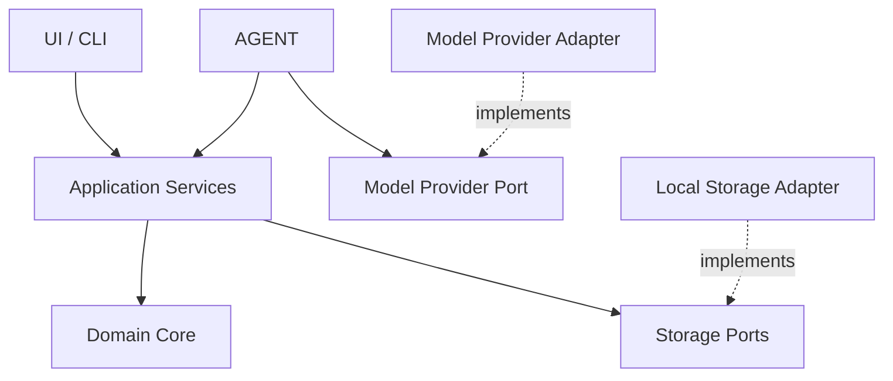
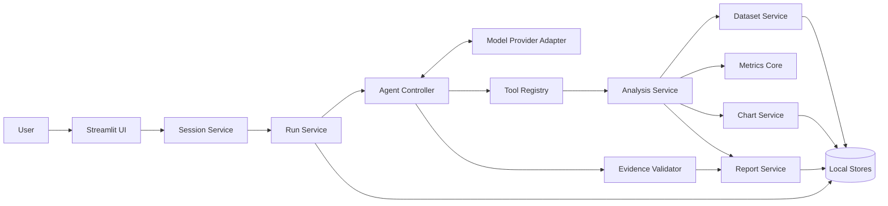
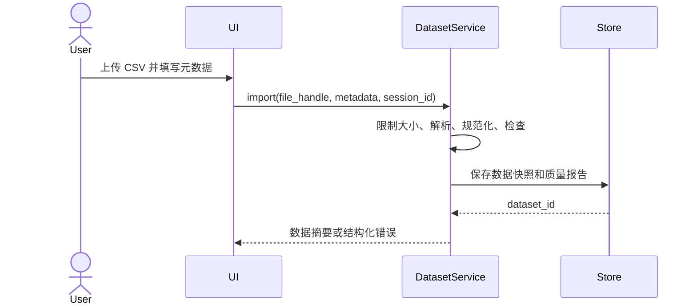
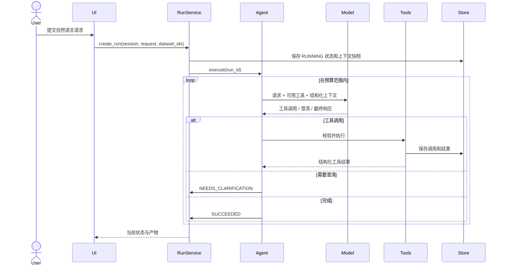
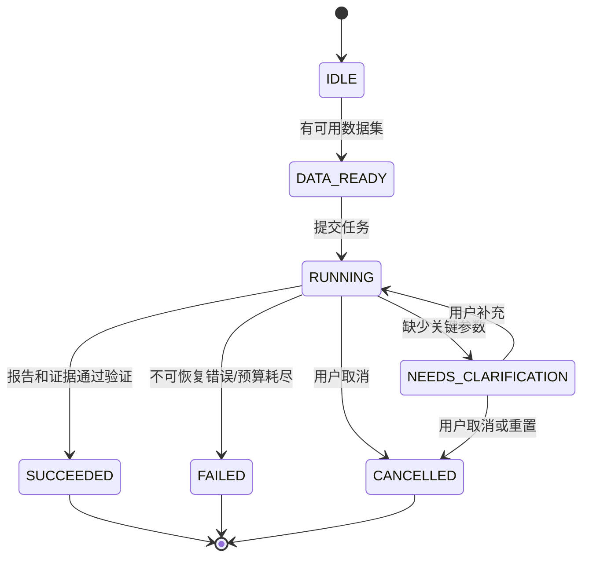
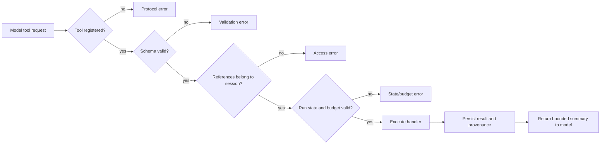
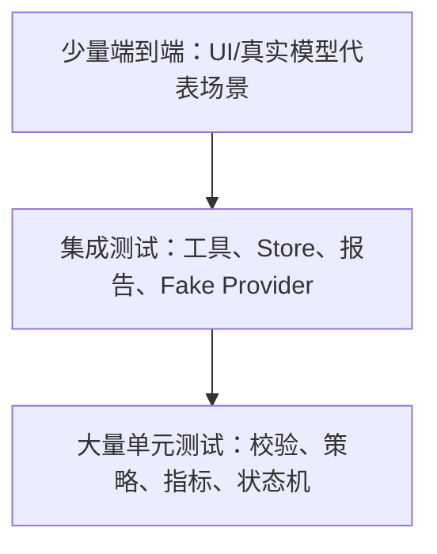

# QuantLab Agent 系统架构

> 文档版本：v1.0  
> 建立日期：2026-09-30  
> 状态：目标架构；M1、M2、本地图表／报告和确定性演示入口已实现并通过测试
> 关联文档：[项目规划](PROJECT_PLAN.md)  
> 说明：本文定义目标架构和关键约束。已实现领域模型、数据导入、分析准备、指标计算、本地 Store、Run Service、Tool Registry、图表、报告和 demo CLI；真实模型 Agent、UI 和真实 Agent 评估仍是待实现设计。

## 1. 架构目标

QuantLab Agent 是一个本地优先的金融时序数据分析应用。用户上传日线价格 CSV，用自然语言描述分析任务；Agent 选择受控工具，确定性程序完成数据校验、指标计算、图表和报告生成。

架构首先服务于以下目标：

1. **计算可信**：模型不能直接提供关键数值，收益、波动率和最大回撤必须由可测试的程序计算。
2. **行为受控**：模型只能调用注册工具，不能执行任意 Python、Shell 或读取任意文件。
3. **可追溯**：每次运行都有独立 ID、输入快照、参数、工具调用和产物引用。
4. **失败明确**：无效数据、缺少参数、模型超时和工具失败必须具有不同状态，不能统一伪装为成功回答。
5. **组件可替换**：更换模型服务或用户界面时，不重写数据校验和量化计算核心。
6. **适合短期交付**：首版使用单进程、本地文件和同步流程，不引入数据库、消息队列或多 Agent 框架。

这里的“可靠”是有限而具体的：对于已支持的数据格式和分析能力，系统能验证输入、稳定计算、记录依据并拒绝不支持的情况。它不代表系统能够验证所有金融数据真实性，也不代表分析结果具有预测能力。

## 2. 架构原则

### 2.1 确定性核心，概率性外壳

模型位于系统外层，负责自然语言理解、工具选择和解释组织；数据处理和数值计算位于内层，结果由代码和数据决定。

相同的数据快照、分析参数和计算版本应产生相同的指标及图表数据。再次调用远程模型时，自然语言表述和工具调用顺序不保证完全相同。

### 2.2 依赖方向向内

核心计算不依赖 Streamlit、模型 SDK 或本地文件系统实现。外层通过接口调用内层，内层不反向导入外层模块。



### 2.3 模型输出一律视为不可信输入

Tool call 即使由受信任模型生成，也必须经过 schema、引用权限、状态和预算校验。提示词是行为引导，不是安全边界。

### 2.4 ID 引用代替路径传递

模型和 UI 使用 `dataset_id`、`analysis_id`、`metrics_id`、`artifact_id`。只有存储适配器知道实际文件路径，从而阻止路径穿越、跨会话读取和意外覆盖。

### 2.5 显式降级优于静默猜测

缺少价格口径时追问或限制结论；日期不规则时不输出日频年化波动率；指标不可计算时返回 `null + reason`，不能用 0 代替。

### 2.6 先单体，保留清晰边界

首版采用模块化单体：一个 Python 进程、一个本地应用、一个运行产物目录。逻辑边界清晰，但不提前拆分微服务。

## 3. 系统边界

### 3.1 系统负责

- 接收用户上传的 1—2 份标准 CSV。
- 保存数据来源、价格口径、币种、频率等声明。
- 检查字段、日期、重复记录和价格有效性。
- 将自然语言请求转成受约束的分析任务。
- 计算区间收益、年化波动率和最大回撤。
- 生成归一化价格图、回撤图和结构化报告。
- 记录运行状态、工具调用、产物和失败原因。
- 提供真实 Agent 模式与确定性演示模式。

### 3.2 系统不负责

- 证明用户上传数据的来源真实或许可有效。
- 自动补齐缺失行情或猜测复权口径。
- 股票推荐、未来收益预测、交易执行和投资建议。
- 任意代码执行、网页抓取和本地文件浏览。
- 复杂回测、全市场数据、分钟行情和多 Agent 协作。

### 3.3 外部依赖

| 依赖 | 首版用途 | 失效时的行为 |
| --- | --- | --- |
| 模型 API | 理解请求并产生工具调用 | 真实模式失败；用户可主动切换演示模式 |
| 本地文件系统 | 临时数据、运行记录和报告产物 | 当前运行失败并保留可读错误 |
| Python 数据处理库 | pandas、NumPy 等计算 | 应用启动检查并报告缺失依赖 |
| 浏览器 | 展示 Streamlit UI | 不影响核心模块的测试和命令行验证 |

模型服务商尚未确定。架构只定义统一接口，不预先承诺支持所有兼容 API 的模型。

## 4. 总体组件



### 4.1 组件职责

| 组件 | 单一职责 | 不应承担 |
| --- | --- | --- |
| Streamlit UI | 收集输入、展示状态与产物 | 指标公式、直接调用模型 SDK |
| Session Service | 管理当前会话、选择的数据集和活动运行 | 保存全局“最近一次结果”供所有会话共享 |
| Run Service | 创建运行、推进状态、取消和保存清单 | 理解自然语言 |
| Agent Controller | 驱动模型—工具循环、控制预算和停止条件 | 直接读写 CSV、计算指标 |
| Model Provider Adapter | 屏蔽模型 API 差异、转换工具调用格式 | 决定业务规则 |
| Tool Registry | 注册工具、验证参数、分派调用 | 包含 UI 状态和模型提示词 |
| Dataset Service | 导入、规范化、检查数据并建立数据集快照 | 生成研究结论 |
| Analysis Service | 组织日期切片、资产对齐和可计算能力 | 自由修改原始数据 |
| Metrics Core | 执行纯数值计算 | 文件访问、网络调用、自然语言解释 |
| Chart Service | 根据分析快照生成图表与图表数据 | 重新计算另一套指标口径 |
| Evidence Validator | 检查结论引用和数据一致性 | 根据主观判断修改计算结果 |
| Report Service | 使用已验证证据生成报告 | 引用其他运行的结果补全当前报告 |
| Local Stores | 保存对象、日志和产物，执行引用隔离 | 决定分析逻辑 |

## 5. 代码组织

预计目录如下。实现时只有在模块出现实际职责后才创建文件，不建立大量空目录。

```text
quantlab-agent/
├── README.md
├── Docs/
│   ├── PROJECT_PLAN.md
│   └── architecture.md
├── pyproject.toml
├── .env.example
├── app.py
├── src/quantlab_agent/
│   ├── domain/
│   │   ├── models.py
│   │   ├── errors.py
│   │   ├── metrics.py
│   │   └── policies.py
│   ├── application/
│   │   ├── datasets.py
│   │   ├── analyses.py
│   │   ├── runs.py
│   │   ├── charts.py
│   │   └── reports.py
│   ├── agent/
│   │   ├── controller.py
│   │   ├── tools.py
│   │   ├── prompts.py
│   │   └── demo.py
│   ├── ports/
│   │   ├── model_provider.py
│   │   └── stores.py
│   ├── adapters/
│   │   ├── model_provider.py
│   │   ├── local_stores.py
│   │   └── plotting.py
│   └── config.py
├── tests/
│   ├── unit/
│   ├── integration/
│   └── contract/
├── evaluation/
│   ├── cases.jsonl
│   └── README.md
├── data/examples/
└── runs/                    # 默认不提交 Git
```

为了减少首版复杂度，多个小文件可以合并，但必须维持三条边界：

- `domain` 不导入 Streamlit、模型 SDK、绘图库和文件存储实现。
- `agent` 不直接处理 DataFrame 或写文件。
- `app.py` 只组合依赖和处理界面事件，不实现业务公式。

## 6. 领域模型与不可变约束

### 6.1 标识符

所有标识符由程序生成，不接受模型自行指定：

- `session_id`：隔离一个浏览器会话可访问的对象。
- `run_id`：一次用户提交及其完整执行生命周期。
- `dataset_id`：一个规范化数据快照。
- `analysis_id`：固定数据集、区间和对齐规则的分析快照。
- `metrics_id`：基于某个 analysis_id 的指标结果。
- `artifact_id`：图表或报告等产物引用。
- `tool_call_id`：一次工具执行记录。

推荐使用不可预测的 UUID。用户可见时可显示短前缀，但内部保存完整值。

### 6.2 核心对象

#### Dataset

```text
Dataset
├── dataset_id
├── session_id
├── asset_id
├── metadata
├── raw_sha256
├── normalized_sha256
├── schema_version
├── date_min / date_max / row_count
├── normalized_data_ref
└── quality_report
```

创建后视为不可变。重新上传或修正数据会创建新的 dataset_id。

#### AnalysisSpec

```text
AnalysisSpec
├── analysis_id
├── run_id / session_id
├── dataset_ids
├── requested_start / requested_end
├── effective_start / effective_end
├── alignment_policy
├── requested_metrics
├── annualization_factor
└── capability_decisions
```

它记录“计算使用了什么”，不能只保存用户最初说了什么。

#### MetricResult

```text
MetricResult
├── metrics_id
├── analysis_id
├── values
├── unavailable_reasons
├── observation_counts
├── assumptions
└── calculation_version
```

不可用值必须使用 `null` 并给出机器可读原因。

#### Run

```text
Run
├── run_id / session_id
├── mode
├── user_request
├── status
├── budgets
├── context_snapshot
├── timestamps
├── failure
└── artifact_ids
```

Run 是状态管理和追踪的聚合根。其他对象必须能追溯到所属 run 或 session。

### 6.3 关键不变量

1. Dataset 创建后，数据内容和哈希不能原地变化。
2. AnalysisSpec 只能引用同一 session 可见的数据集。
3. MetricResult 的 analysis_id 创建后不能替换。
4. 报告中的指标和图表必须来自相同 analysis_id。
5. 终态运行不能重新进入 RUNNING；重试需要创建新 run_id。
6. 取消或过期运行返回的结果不能更新当前活动运行。
7. 未通过数据质量门禁时不能创建可执行 AnalysisSpec。
8. 失败运行可以保存诊断产物，但不能包含成功报告标志。

## 7. 主要执行流程

### 7.1 数据导入



导入流程不需要模型参与。上传文件名仅用于展示，经清理后保存；实际路径由系统生成。

### 7.2 真实 Agent 分析



Agent 每轮只能产生以下一种动作：`ToolRequest`、`ClarificationRequest`、`FinalAnswer`。无法解析或同时产生冲突动作时视为协议错误，允许一次受预算约束的纠正。

### 7.3 演示模式

演示模式通过固定场景和确定性规则调用相同 Tool Registry、Analysis Service 和存储层。它绕过 Model Provider 和自由文本规划，但不复制另一套计算实现。

因此，演示模式能证明工具链与 UI 可运行，不能用于证明真实模型的工具选择能力。

### 7.4 澄清与恢复

当关键参数缺失时：

1. Agent 输出结构化澄清问题和待补字段。
2. Run 进入 `NEEDS_CLARIFICATION`，保存当前轮数和预算使用量。
3. 用户回答后，Run Service 验证回答是否仍属于同一活动运行。
4. Run 回到 `RUNNING`，把结构化已确认字段传入下一轮。

首版最多进行有限次数澄清；超过预算后运行失败并说明缺少的信息。不得无限追问。

## 8. 状态与并发控制

### 8.1 状态机



`IDLE` 和 `DATA_READY` 更接近会话状态；`RUNNING` 之后是运行状态。实现时可分别建模，不能因为画在同一张图里就使用一个全局枚举承担所有职责。

### 8.2 竞争条件处理

- UI 中保存 `active_run_id`。
- 每次异步或耗时操作完成后，先比较返回的 run_id 与 active_run_id。
- 用户重新提交产生新 run_id，旧运行即使完成也只写入自身目录。
- 禁用或去重同一请求的重复点击；首版可采用按钮锁。
- 本地 JSON 文件使用“临时文件写入后原子替换”，避免进程中断留下半个文件。
- 产物文件名由程序生成，不复用用户文件名。

首版单进程不承诺多个进程同时写同一 runs 目录。未来部署多进程前，需要把 Run Store 换成支持事务或锁的持久层。

## 9. Tool Calling 架构

### 9.1 工具注册

每个工具由四部分构成：

```text
ToolDefinition
├── name
├── description
├── input_schema
└── handler
```

工具定义是模型可见的最小接口，handler 不直接暴露给模型。工具输出统一包装为：

```json
{
  "ok": true,
  "run_id": "...",
  "tool_call_id": "...",
  "data": {},
  "warnings": [],
  "error": null,
  "provenance": {
    "dataset_ids": [],
    "analysis_id": null
  }
}
```

### 9.2 执行管线



### 9.3 首版工具

| 工具 | 输入 | 成功输出 | 前置条件 |
| --- | --- | --- | --- |
| `inspect_dataset` | dataset_id | 元数据、质量摘要、范围 | 数据集属于当前 session |
| `prepare_analysis` | dataset_ids、日期、指标 | analysis_id、有效区间、能力决定 | 数据质量通过或允许降级 |
| `compute_metrics` | analysis_id、指标枚举 | metrics_id、数值、不可用原因 | analysis_id 有效且属于当前 run |
| `create_charts` | analysis_id、图表枚举 | artifact_ids、图表元数据 | 分析数据可绘制 |
| `build_report` | analysis_id、metrics_id、artifact_ids | report artifact_id | 引用一致且证据验证通过 |

工具返回给模型的内容应有长度上限。模型通常只需要摘要、指标和错误，不需要完整价格序列。

## 10. 数据与计算架构

### 10.1 数据管线

```text
上传字节
  → 文件限制与编码检查
  → CSV 解析
  → 字段和类型规范化
  → 质量检查
  → 不可变数据集快照
  → 日期切片与资产对齐
  → 不可变分析快照
  → 指标和图表
```

原始数据、规范化数据和分析切片属于不同层次，必须分别记录哈希或引用，避免无法确认某个指标到底使用哪一份数据。

### 10.2 纯计算接口

指标核心优先使用无副作用函数：

```python
def period_return(prices: Series) -> float: ...
def simple_returns(prices: Series) -> Series: ...
def annualized_volatility(returns: Series, periods_per_year: int) -> float: ...
def drawdown_series(prices: Series) -> Series: ...
def max_drawdown(prices: Series) -> float: ...
```

函数接收已经验证、排序和切片的数据，不在内部偷偷删除坏值、补值或选择日期。输入前置条件由 Analysis Service 保证，函数仍应对违反契约的输入抛出领域错误。

### 10.3 计算版本

首版可用项目版本加指标算法版本，例如 `metrics-v1`。MetricResult 保存该版本。公式或边界语义变化时提升版本，并重新运行相关测试；不能用新实现覆盖旧结果后仍声称完全复现。

## 11. 报告与证据架构

### 11.1 证据类型

- `DatasetEvidence`：数据源声明、哈希、日期范围和质量检查。
- `MetricEvidence`：metrics_id、analysis_id、原始精度数值和口径。
- `ChartEvidence`：artifact_id、analysis_id、图表类型和数据哈希。
- `LimitationEvidence`：能力降级、未核验事项和不可用原因。

### 11.2 报告生成策略

报告分为确定性部分和模型辅助部分：

- 标题、数据范围、指标表、口径、运行 ID 由模板生成。
- 数字和比较方向由程序根据 MetricEvidence 填入。
- 模型可以组织自然语言摘要，但只能引用提供的 evidence_id。
- Evidence Validator 检查所有引用属于当前 run、analysis_id 一致且值存在。
- 验证失败时使用确定性模板，不输出未经验证的模型正文。

只有价格数据时，报告可以描述涨跌、波动和回撤，不能推断政策、情绪、资金流等原因。

### 11.3 成功的定义

只有同时满足以下条件，Run 才能进入 `SUCCEEDED`：

1. 所需工具调用完成且没有阻断错误。
2. 报告要求的指标存在，或已明确记录不可用原因。
3. 图表和指标引用一致。
4. 证据验证通过。
5. manifest 已成功保存。

“模型返回了一段回答”不等于运行成功。

## 12. 存储架构

### 12.1 首版本地存储

```text
runs/
└── <session_id>/
    ├── datasets/
    │   └── <dataset_id>/
    │       ├── manifest.json
    │       └── normalized.csv
    └── runs/
        └── <run_id>/
            ├── manifest.json
            ├── request.json
            ├── analysis_config.json
            ├── quality_report.json
            ├── metrics.json
            ├── tool_calls.jsonl
            ├── charts/
            └── report.md
```

具体布局可在实现中调整，但 Store 接口应隐藏路径结构。

### 12.2 Store 接口

建议至少定义：

- `DatasetStore.get(dataset_id, session_id)`
- `DatasetStore.save(dataset)`
- `RunStore.create(run)`
- `RunStore.transition(run_id, expected_state, new_state)`
- `RunStore.append_tool_call(run_id, record)`
- `ArtifactStore.put(run_id, kind, content)`
- `ArtifactStore.get(artifact_id, session_id)`

读取时同时验证对象 ID 与 session_id。路径边界检查是存储适配器的职责，不能只依靠 UI 隐藏按钮。

### 12.3 保留与清理

首版不自动删除用户运行，以避免意外丢失；README 应说明 `runs/` 可能包含用户数据并默认被 Git 忽略。后续若增加清理功能，需要按明确 session/run 目标执行，不进行模糊递归删除。

## 13. 模型适配层

### 13.1 统一接口

```python
class ModelProvider(Protocol):
    def complete_with_tools(
        self,
        messages: list[Message],
        tools: list[ToolDefinition],
        timeout_seconds: float,
    ) -> ModelTurn: ...
```

`ModelTurn` 只暴露应用需要的字段：文本、工具请求、停止原因、服务商请求 ID、可用的 token 统计和错误分类。

### 13.2 适配器责任

- 把内部工具定义转换为服务商格式。
- 把服务商返回转换为统一 ModelTurn。
- 设置超时并将错误分类为鉴权、限流、超时、协议或未知错误。
- 不在适配器内实现业务重试循环。
- 不记录 API 密钥和完整敏感请求。

### 13.3 重试策略

- 鉴权和无效请求不重试。
- 超时、限流和临时服务错误最多重试一次。
- 重试计入模型交互预算，并采用短暂退避。
- Provider SDK 自带重试时必须关闭或纳入统一预算，避免两层叠加。

## 14. 配置与依赖注入

配置从环境变量和明确默认值加载，在应用启动时一次验证：

- `APP_MODE`
- `MODEL_PROVIDER`
- `MODEL_NAME`
- `MODEL_BASE_URL`
- `MODEL_API_KEY`
- `RUNS_DIR`
- 文件大小、行数、模型轮数、工具次数和超时限制

敏感值使用专门 Secret 类型，禁止出现在 `repr`、日志和错误信息中。

应用入口负责组合具体实现：

```text
Config
  → Local Stores
  → Dataset / Analysis / Report Services
  → Tool Registry
  → Model Provider（真实模式才创建）
  → Agent Controller
  → UI
```

测试可以注入内存 Store 和 Fake Model Provider，不需要真实网络和磁盘。

## 15. 安全与隐私边界

### 15.1 威胁清单

| 风险 | 主要控制 |
| --- | --- |
| 恶意文件名和路径穿越 | 系统生成路径，文件名只作清理后的显示文本 |
| 超大 CSV 导致资源耗尽 | 上传字节数、行数和解析时间限制 |
| CSV 内容提示注入 | 文件字段视为数据，不进入系统指令，不允许修改工具集 |
| 模型请求任意工具 | 工具白名单与 schema 校验 |
| 跨会话访问 | 每次读取同时验证 session_id 和对象 ID |
| API 密钥泄漏 | 环境变量、日志脱敏、`.env` 忽略 |
| 日志包含敏感原始数据 | 默认记录摘要和哈希，不记录完整 CSV |
| 任意代码执行 | 首版没有执行代码的工具 |
| 公式注入 | 导出 CSV 时再考虑转义；首版报告以 Markdown/图片为主 |
| HTML/Markdown 注入 | UI 使用安全渲染；不启用原始 HTML |

### 15.2 发给模型的数据

默认只发送：用户问题、可用数据集的受控元数据、质量摘要、结构化指标和工具错误。完整原始价格序列留在本地。

如果未来某项功能确实需要把原始数据发给模型，必须修改产品说明和隐私提示，不能悄悄扩大传输范围。

## 16. 可观测性

### 16.1 结构化事件

至少记录：

- `run.created`
- `run.state_changed`
- `model.request_started/completed/failed`
- `tool.started/completed/failed`
- `artifact.created`
- `evidence.validation_failed`
- `run.completed`

事件字段包含 timestamp、session_id、run_id、组件、事件名、耗时、状态和错误码。工具参数只记录经筛选的安全版本。

### 16.2 用户可见日志

界面展示“检查数据 → 准备分析 → 计算指标 → 生成图表 → 验证报告”等动作摘要，而不是模型隐藏推理、完整提示词或堆栈。

### 16.3 开发日志

开发日志可以包含调用栈和调试字段，但必须过滤密钥、上传文件内容和绝对敏感路径。生产式演示默认使用 INFO 级别。

## 17. 错误模型

统一领域错误包含：

```text
AppError
├── code
├── user_message
├── retryable
├── details
└── cause                 # 仅内部使用
```

错误分为四层：

| 层 | 示例 | 谁处理 |
| --- | --- | --- |
| 输入错误 | 缺列、日期无效、价格非正 | Dataset/Tool 返回用户可修正信息 |
| 业务限制 | 无重叠日期、口径不兼容 | Agent 澄清或明确停止 |
| 外部依赖 | 模型超时、限流 | Provider 分类，Controller 有限重试 |
| 内部错误 | 写文件失败、未预期异常 | Run 标记失败，日志保留内部原因 |

用户消息不展示原始堆栈。内部未知错误使用统一错误码，同时保留 correlation/run ID 便于定位。

## 18. 测试架构

### 18.1 测试金字塔



### 18.2 各层验证

#### 单元测试

- 手工可验证的指标样例和边界样例。
- 数据质量规则和能力降级策略。
- 状态转换和运行预算。
- 引用归属与 Evidence Validator。
- 报告确定性字段和不可用值格式。

#### 集成测试

- 上传 CSV 到 Dataset Store。
- Tool Registry 的完整校验管线。
- Fake Provider 驱动的正常、澄清、错误和循环预算路径。
- 图表和指标使用相同 AnalysisSpec。
- 进程中断或写失败下的原子文件行为。

#### 契约测试

- Provider Adapter 对工具请求、文本响应和错误的映射。
- Tool Definition 与处理器输入模型一致。
- Store 接口的内存实现和本地实现行为一致。

#### 端到端与 Agent 评估

- 演示模式验证完整本地流程。
- 真实模型验证自然语言、工具选择和澄清。
- 项目规划中的 E01—E24 作为评估基线。

真实模型评估与确定性测试分开报告，不能因为 Fake Provider 全部通过就声称 Agent 稳定。

## 19. 性能与资源边界

首版面向 1—2 份、每份不超过建议 5 MB 和 5 万行的日线 CSV，单用户本地运行。目标不是高并发。

实施阶段需测量并记录：

- 导入和检查样例数据的耗时。
- 指标计算与图表生成耗时。
- 模型调用耗时和重试次数。
- 单次运行产物大小。

首版不预先承诺毫秒级响应。用户等待最长的通常是远程模型调用，因此界面需要阶段状态与超时提示。

## 20. 关键架构决策

### ADR-001：采用模块化单体

- **决定**：单进程 Python 应用，按领域、应用、Agent、端口和适配器分层。
- **原因**：项目规模小，拆服务会增加部署、通信和调试成本。
- **代价**：不支持多进程并发写，需要在未来部署时更换存储方案。

### ADR-002：不采用多 Agent 框架

- **决定**：使用一个受控 Agent Controller。
- **原因**：首版任务可以由单一工具循环完成，更容易观察和评估。
- **代价**：未来复杂任务需要扩展规划能力，但不影响核心工具复用。

### ADR-003：模型不执行任意代码

- **决定**：模型只能调用固定工具。
- **原因**：控制文件、网络和执行权限，便于测试。
- **代价**：不支持用户提出任意新计算；新增能力需要显式开发工具。

### ADR-004：本地文件存储优先

- **决定**：首版使用 JSON、JSONL、CSV、Markdown 和图片。
- **原因**：易检查、易展示、无需数据库运维。
- **代价**：多进程事务和查询能力有限。

### ADR-005：真实模式与演示模式共用工具层

- **决定**：两种模式只在决策来源上不同。
- **原因**：避免两套计算逻辑产生不同结果。
- **代价**：演示模式只能覆盖预设任务，不能代表真实自然语言能力。

### ADR-006：报告采用证据驱动生成

- **决定**：关键数字、比较方向和限制来自结构化证据。
- **原因**：降低模型生成错误数字和无依据结论的风险。
- **代价**：报告表达自由度降低，需要维护模板和 evidence schema。

## 21. 演进路径

### 阶段 1：确定性核心

实现领域模型、CSV 质量检查、AnalysisSpec、三个指标和测试。此阶段完全不依赖模型。

### 阶段 2：应用与工具层

已实现本地 Store、运行状态、工具注册和确定性演示模式，并通过测试验证完整本地工具链。

### 阶段 3：真实 Agent

选择一个模型服务，实现 Provider Adapter、工具循环、澄清和预算控制。

### 阶段 4：UI 与可信报告

图表、报告和证据引用已在本地服务层实现；Streamlit 页面、下载交互和用户可视化流程仍待实现。

### 阶段 5：评估与加固

执行 E01—E24，修复计算、隔离、错误处理和模型行为问题，补全 README 与演示材料。

后续可能演进为在线数据、简单回测或部署版本，但只能在首版证据链稳定后进行。

## 22. 架构验收清单

实现过程中用以下清单判断代码是否仍符合架构：

- [x] 指标模块在没有 UI、模型和文件系统时可独立测试。
- [ ] UI 中没有收益、波动率或回撤公式。
- [ ] 模型适配器不包含业务判断。
- [x] 所有工具参数经过结构和归属验证。
- [x] 模型无法提交本地路径或执行代码。
- [x] 数据集、分析和指标对象创建后不可原地修改。
- [ ] 当前页面只接受 active_run_id 的结果。
- [x] 报告的指标、图表和数据范围引用同一 analysis_id。
- [x] 不可计算的指标返回 null 和原因。
- [x] 演示模式在报告和 CLI 输出中有明确标识；UI 标识待实现。
- [ ] 真实模型失败不会静默切换模式。
- [x] 上传原始数据默认不发送给模型；当前尚未实现模型 Provider。
- [ ] 运行记录不包含 API 密钥和完整敏感数据。
- [ ] 正常、澄清、失败、取消和预算耗尽路径均有测试。
- [ ] README 描述与实际能力一致。

## 23. 实现前仍需确定的事项

以下选择不会阻止领域核心开发，但会影响外层适配器：

1. 实际使用的模型服务商和模型。
2. Python 版本与各依赖的兼容版本。
3. Streamlit 对任务取消和会话状态的具体实现方式。
4. 首版报告下载采用单 Markdown，还是 ZIP 内含 Markdown 与图片。
5. 是否在本地持久保存原始上传文件；默认建议仅保存规范化快照并明确告知用户。
6. 合成演示数据的具体生成规则和公开许可说明。

这些事项应在对应里程碑开始时决定，并在本文的 ADR 或项目规划接续记录中更新。
